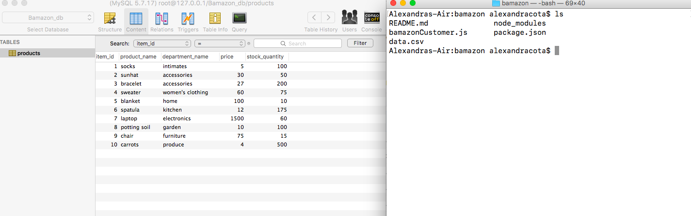
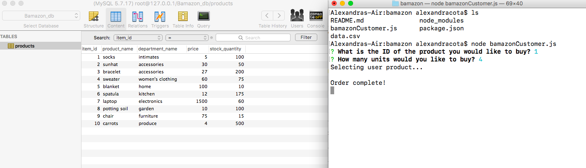
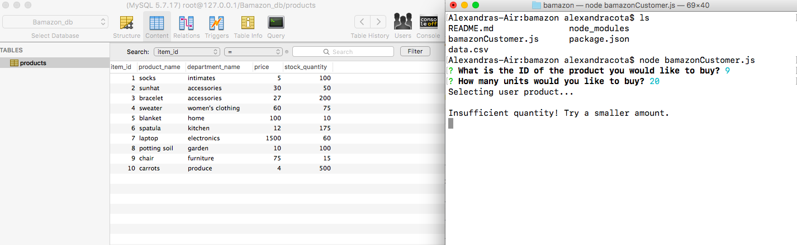

# bamazon

# This is what the MySQL database looks like. The program will reference the id's and the stock quantities in this database.

# User is prompted to select a product by it's ID and a quantity desired.

# If the user selects an amount that is LESS than the total amount available in stock for a product, the program will notify the user that the program is complete.

# If the user selects an amount that is MORE than the total amount available in stock for a product, the program will notify the user that the there is an insuffiecient quantity and the order will not be processed.

